# CSV Loader App
## Приложение для загрузки и просмотра .csv - файлов.

### Запуск приложения

скопировать docker-compose.yml, docker.env в любую папку

[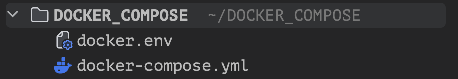](images/img_01.png)
```commandline
docker-compose -f docker-compose.yml up -d
```
[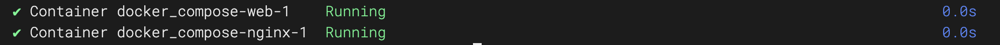](images/img_02.png)
[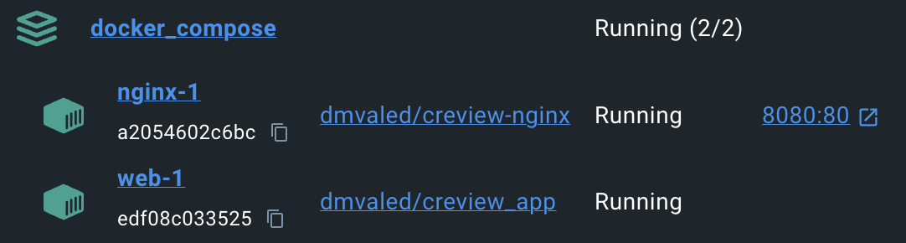](images/img_03.png)

в браузере перейти по ссылке http://localhost:8080/

[](images/img_04.png)

### Работа приложения

Реализован нестандартный вариант Django авторизации по email.
Форма регистрации пользователя:

[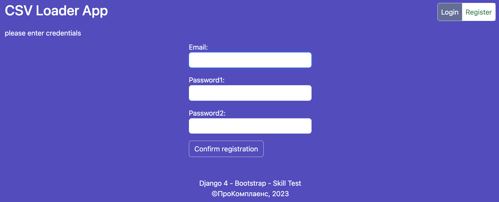](images/img_05.png)

После входа на главной странице таблица просмотра загруженных файлов:

[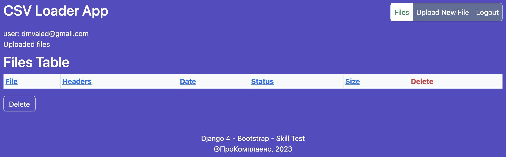](images/img_06.png)

Таблица пуста. Загружаем данные:

[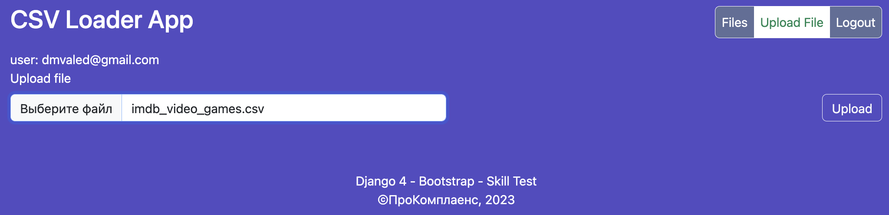](images/img_07.png)
[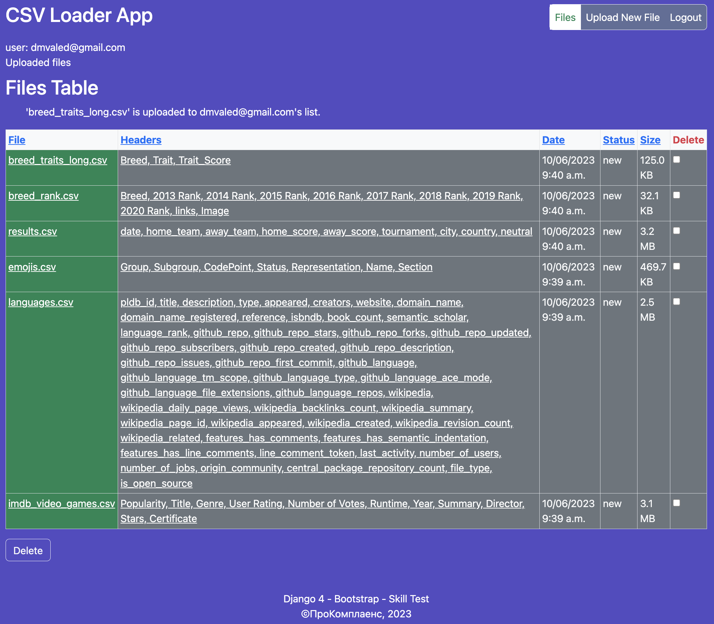](images/img_08.png)

После загрузки доступен предварительный и кастомизированный просмотр загруженных .csv:

Предварительный:

[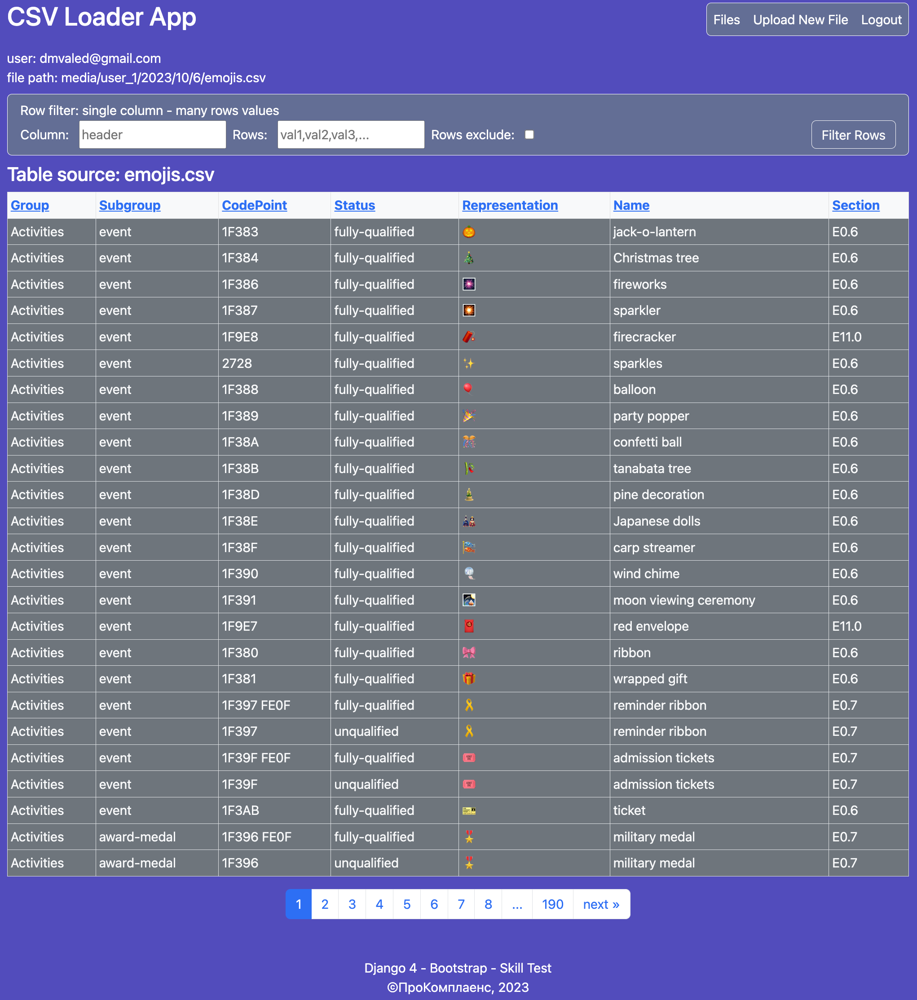](images/img_09.png)

Выбор нужных столбцов, подключение внешних ссылок:

[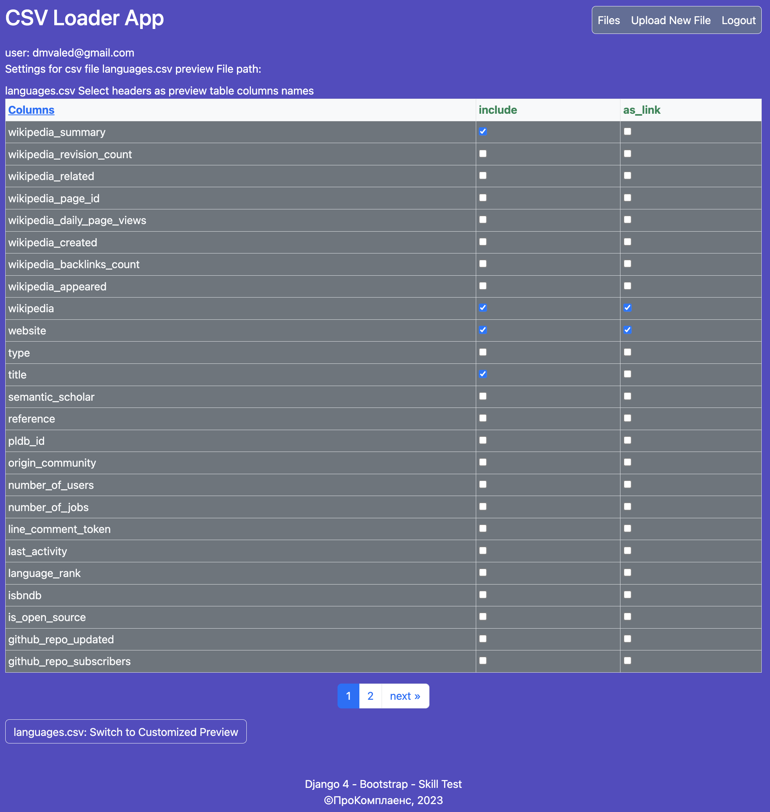](images/img_10.png)

Кастомизированный просмотр, внешние ссылки активированы:

[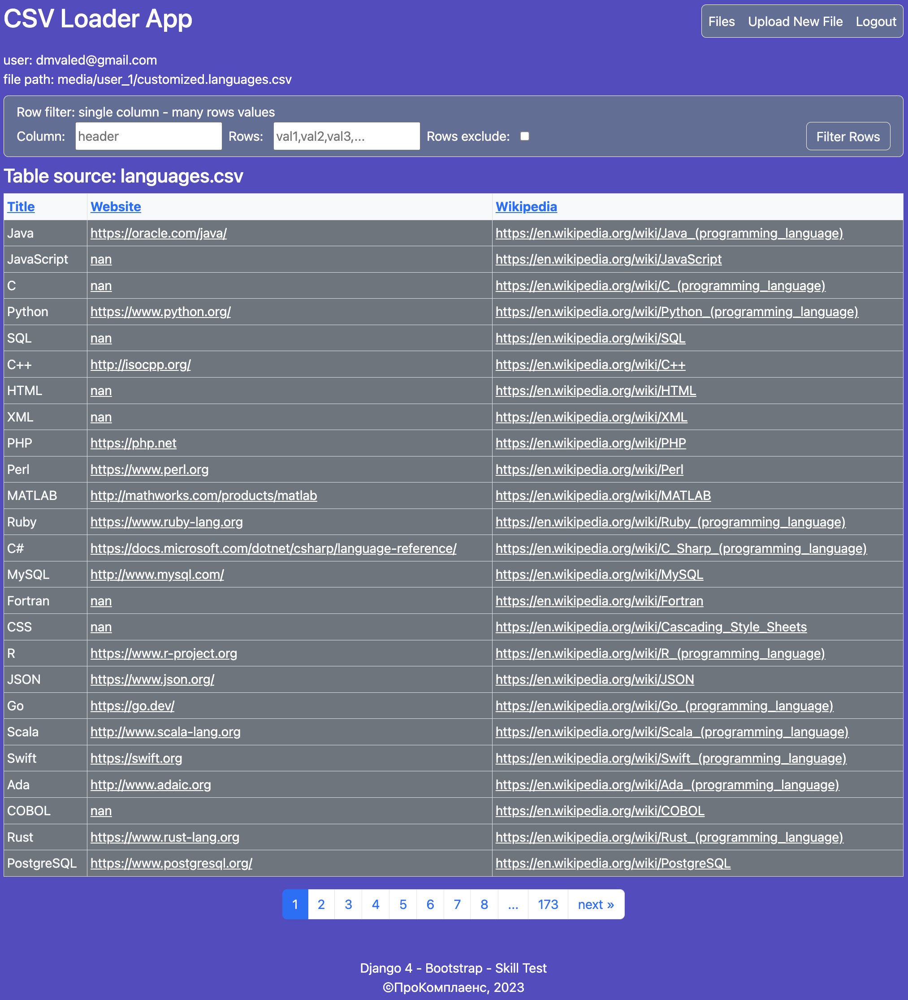](images/img_11.png)

Фильтрация по nan (исключаем):

[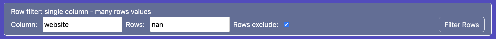](images/img_12.png)

Результат - осталось 55 страниц:

[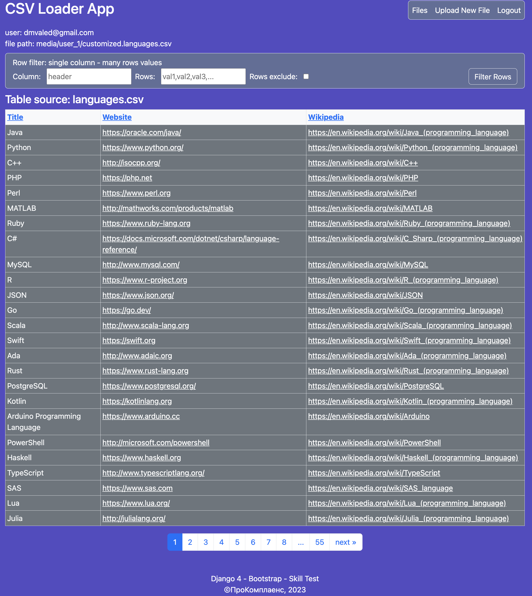](images/img_13.png)

Фильтрация возможна и на странице предварительного просмотра.
Возьмем результаты футбольных матчей:

[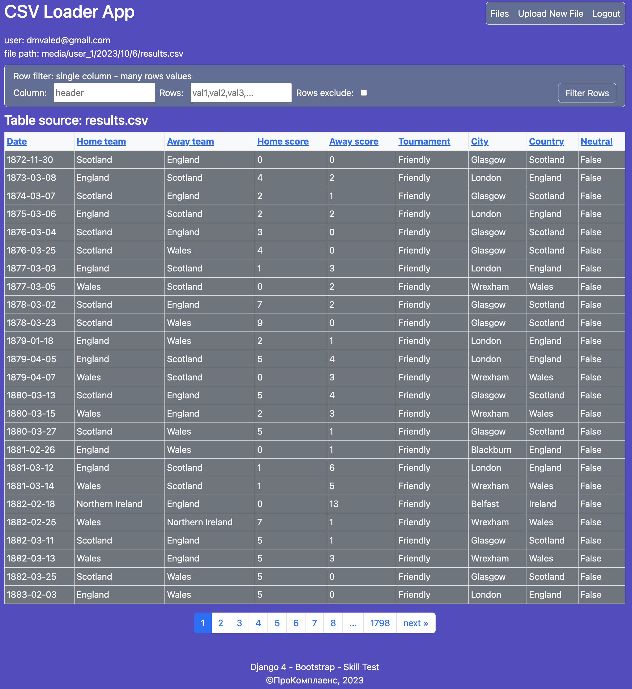](images/img_14.png)

и отфильтруем по домашнему счету Home score:

[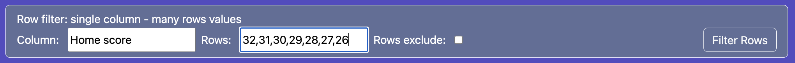](images/img_15.png)

Получаем сюрприз - вот это футбол! Взглянуть бы хоть одним глазком!

[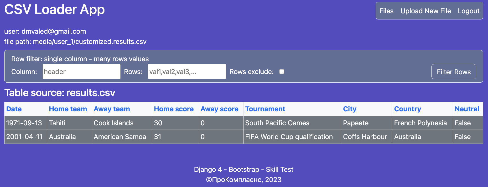](images/img_16.png)

Сортировка по возрастанию/убыванию работает по всем колонкам при клике по заголовку таблицы.
Использован последовательный переключатель (возрастание - убывание).
Данные сохраняются в структурированную по дате папку пользователя.

[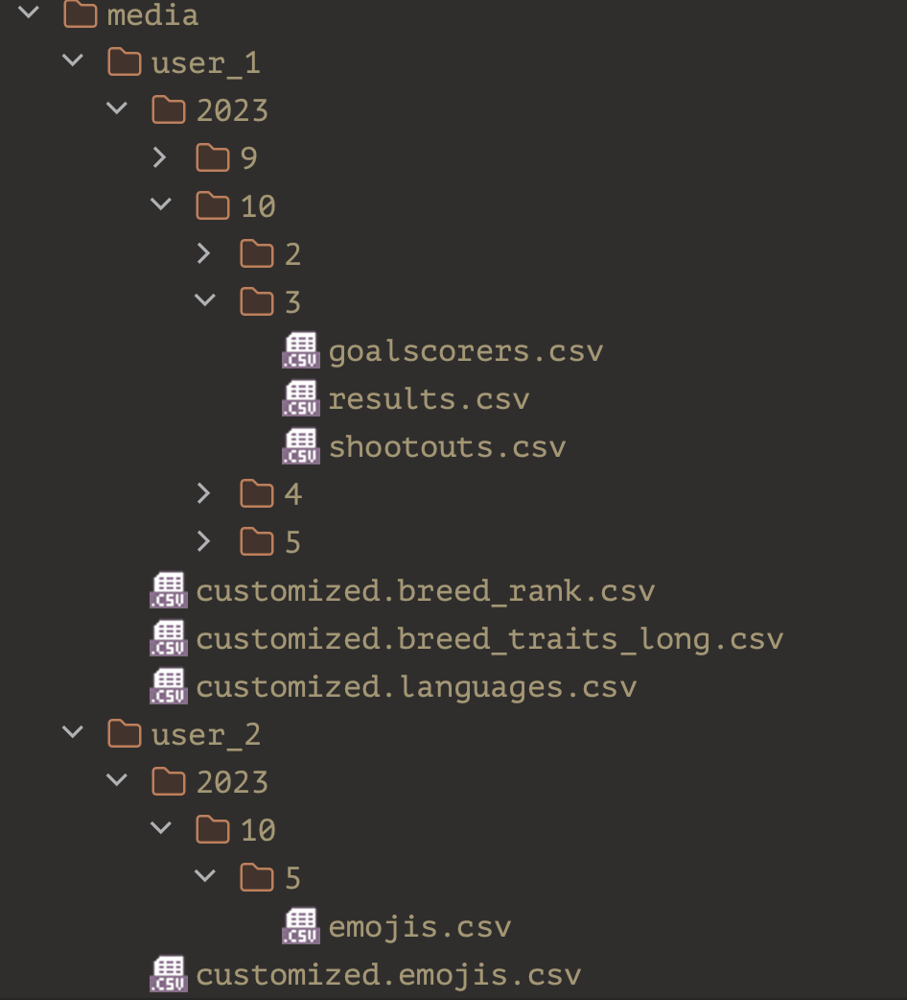](images/img_17.png)

Действия пользователя учитываются в кастомизированном файле последовательно.
(фильтрации накладываются одна за одной). Таким образом можно быстро получить нужную выборку из исходного .csv - файла.

### Примененные решения

Приложение содержит элементы production-ready:
```python
if DEBUG:
    INSTALLED_APPS += [
        # Dev extensions
        "debug_toolbar",
        "coverage",
    ]
    MIDDLEWARE += [
        # Dev extensions
        "debug_toolbar.middleware.DebugToolbarMiddleware",
    ]
```

Использованы инструменты для нормализации данных
```python
def filter_by_rows_values(val_dict, dataframe, not_include):
    """Executes multiple row search with one or many column's values"""

    # df columns headers all lowercase
    dataframe.columns = [
        str(x).lower().replace(" ", "_") for x in dataframe.columns
    ]
```
Переопределены методы django tables2:
```python
def get_attrs(self, **kwargs):
    attrs = AttributeDict(computed_values(self.attrs or {}, kwargs=kwargs))
    cell_data = str(self.compose_url(**kwargs))
    req = "?req=" + cell_data.strip("/")
    if "," in cell_data:
        # link to set_csv_preview embedded to headers string
        attrs["href"] = f"/customize_csv/{req}"
        return attrs
    # link to uploaded csv file table view embedded to file name
    attrs["href"] = f"/csv_table/{req}"
    return attrs
```
